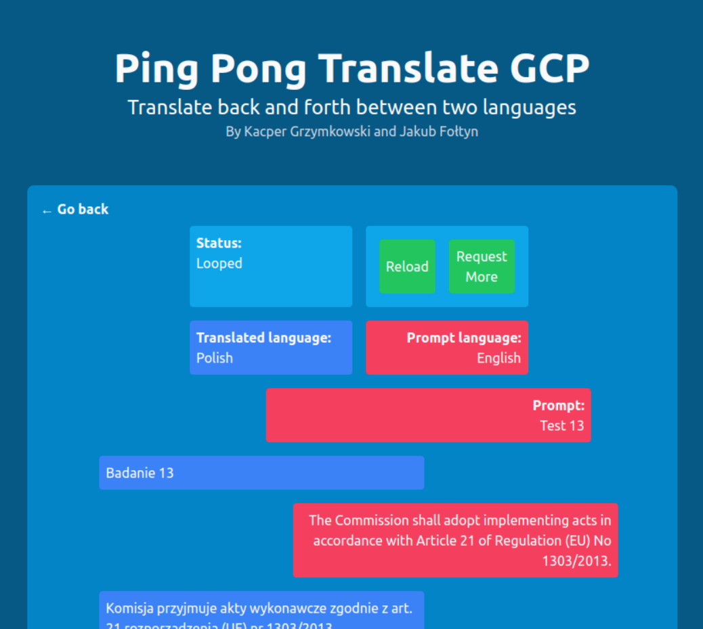

# Ping Pong Translate Application
`Authors: Kacper Grzymkowski, Jakub Fołtyn`

App to translate back-and-forth between two languages hosted on GCP. WUT MINI Cloud Computing Project.

## Overview
This app allows uploading phrases from different languages. 
The phrase is then translated by a machine learning model into another language, and then the process is repeated multiple times (in a “ping pong” manner) translating the phrase from source language to target language and back.
In the end the user can view how the phrase was distorted by multiple translations.   

## Hosting
App is available (while we still fit in the free tier anyway) [here](https://ping-pong-translate.web.app/).
It might take a bit of time (~1 minute) to warm up from a cold start.

## Screenshots

## Technologies used
* GCP
  * Firebase hosting
  * Cloud Functions
  * Cloud Run
* Translation module
  * Docker
  * Huggingface transformers
* Front-end
  * TailwindCSS
  * Plain JS
